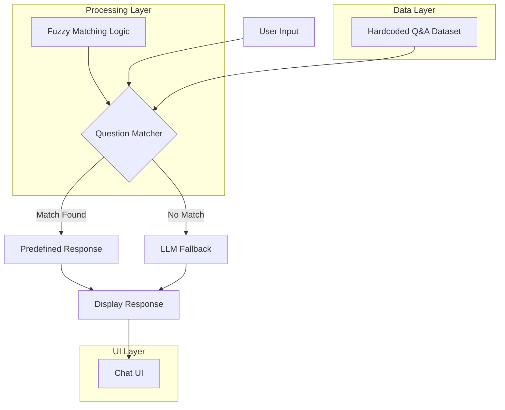

# Thoughtful AI Agent - Architecture Diagram

## System Architecture Overview

This diagram illustrates the flow of data through the Thoughtful AI customer support agent system, showing how user questions are processed through either predefined responses or LLM fallback.

## Component Descriptions

### Data Layer
- **Hardcoded Q&A Dataset**: Contains the 5 predefined questions and answers about Thoughtful AI's healthcare automation agents (EVA, CAM, PHIL)

### Processing Layer
- **Question Matcher**: Core component that determines if user input matches any predefined questions
- **Fuzzy Matching Logic**: Uses FuzzyWuzzy library to handle variations in phrasing with configurable similarity threshold (default: 70%)

### UI Layer
- **Chat UI**: Streamlit-based interface providing conversation history and real-time interaction

## Data Flow Explained

1. **User Input**: User types a question in the chat interface
2. **Question Matcher**: Analyzes input using fuzzy string matching against predefined questions
3. **Decision Point**: 
   - If similarity score ≥ threshold → Return predefined response
   - If similarity score < threshold → Forward to LLM for general response
4. **Display Response**: Show answer in chat UI with proper formatting
5. **Chat UI**: Maintains conversation history and provides continuous interaction 